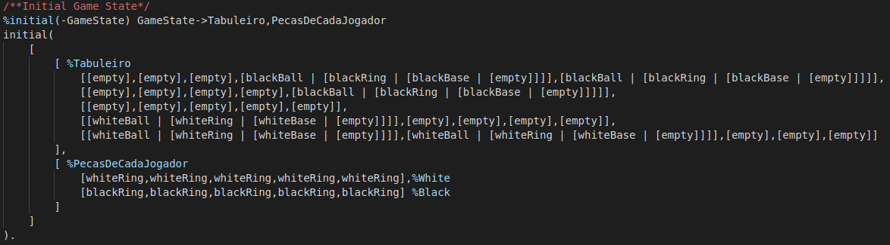
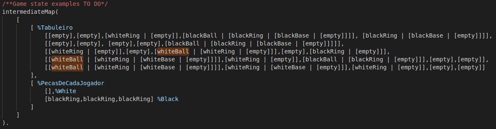
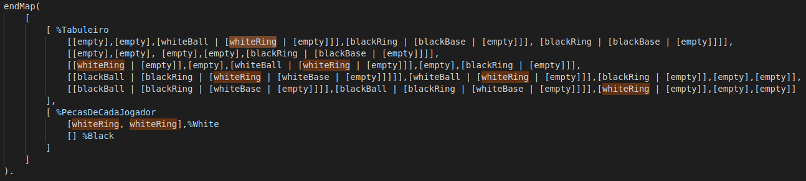
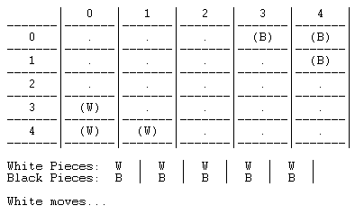
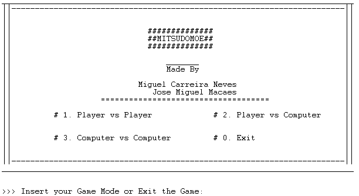

# PLOG2020
## Mitsudomoe Board game
### FEUP MIEIC PLOG 3rd year 2020/2021

__Class 2__
__Group Mitsudomoe_1__

##### Authors:
up201608657 Miguel Carreira Neves  
up201806622 José Miguel Afonso Maçães

### Game Description

Set in a __5x5 board__, each player has __3 balls and 5 rings__ to be placed on the board. 3 balls are placed on top of 3 rings in one corner of the board and the opponents 3 balls and rings are placed in the same disposition in the opposite corner. __The goal is to get all 3 of your balls to your goal spaces opposite your starting corner (where your opponent starts the game).__

##### General Rules
__1.__ Once a component is in play, it never leaves the board
__2.__ A ball can only sit directly on a ring of the same colour
__3.__ _Adjacent_ means "orthogonally or diagonally adjacent"
__4.__ Once a ball reaches one of its goal spaces, it never leaves that space

##### Gameplay
The players take turns either (_1_) placing or moving one of their rings __or__ (_2_) moving one of their balls. __If you are unable to perform either of these steps, you lose.__

__1.__ Place a new ring from your supply _or_ move an exposed ring of yours (neither a ring nor a ball on top of it) on the board. The destination space can be any place that does not have a ball on it (it can have any number of rings or no rings on it).

__2.__ Move one of your balls (that is not in a goal space) to an adjacent space that has your ring on top _or_ vault over anyone's adjacent balls.

__Vaulting over an adjacent balls:__ Your ball can vault over any number of any balls in a straight line, if the first space after that line has a ring of your color on top. After the vault, relocate each ball over which you vaulted that belongs to your opponent to any space with your opponents ring on top. If there are no valid destinations for each of your opponents ball over which you vaulted, you cannot preform the vault. You also cannot vault over opponents balls that have reached their goal spaces.

##### Game End
If, at the end of your turn, all your balls have reached your opponents home spaces, __you win__.

[More information on the game rules](https://nestorgames.com/rulebooks/MITSUDOMOE_EN.pdf)

### Internal Game Representation

##### Board
The board is represented internally using a 5x5 matrix (list of lists), initialized with all empty spaces, except for the starting spaces of each player (3 balls on top of 3 rings in one corner and the same for the opponent on the opposing corner).

##### Pieces
Rings and Balls are represented by atoms: __whiteRing__ and __blackRing__ are the atoms used to represent rings and __whiteBall__ and __blackBall__ are the atoms used to represent balls.
There are also two other atoms: __empty__ represents an empty space and __blackBase__ and __whiteBase__ represent the home spaces of each player.

##### Current Player
The current player is determined by a predicate gameLoop, that switches between players' turns.

##### Initial state

##### Intermediate state

##### End state

### Game Display

##### Board Display
The board is displayed row by row, column by column, using printRow, printMatrix and printMap predicates. Letters (A-E) and numbers (1-5) are also displayed to aid references to spaces (Letter/Number coordinates).

##### Pieces Display
Each space may have some simbols to represent what is on top of that space. An empty space is represented by __' . '__, rings with the first letter of their colour (__' W '__ and __' B '__), balls are similarly represented, but with parentheses around the letter (__'(W)'__ and __'(B)'__). The home spaces of each player are represented by __'WoW'__ (for white) and __'BoB'__ (for black).

##### Initial state

##### Intermediate state

##### End state

### Image examples
##### Menu
