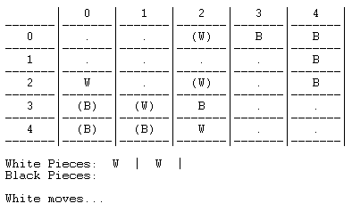

# PLOG2020

## Mitsudomoe Board game

### FEUP MIEIC PLOG 3rd year 2020/2021

__Class 2__
__Group Mitsudomoe_1__

##### Authors:

up201608657 Miguel Carreira Neves

up201806622 José Miguel Afonso Maçães

 
### Instalation and Execution

In order to play Mitusomoe you must:

- Run sicstus with command ```./sicstus```
- Consult game file using ```consult('pathto/mistudomoe.pl').```
- Enter command ```play.``` in SICStus

### Mitsudomoe
Mitsudomoe is a board game set in a **5x5 board**. Each player has **3 balls and 8 rings** to be placed on the board. Players take turns laying rings for their balls to move closer to their goal spaces. **The goal is to get all 3 of your balls to your goal spaces opposite your starting corner (your opponents starting spaces).**
The starting disposition consists of 3 balls placed on top of 3 rings in one corner of the board and the opponents 3 balls and rings placed in the same disposition in the opposite corner. Each player is left with 5 rings in hand to start the game.
A **turn** consist of performing 2 sequential steps:
**1) Ring Step:** Place a ring from your supply on the board or move one already played. You can move anywhere, including on top of other rings or stacks of rings, except on top of a ball.
**2) Ball Step:** Move a ball on the board. You can only move to a place with a ring of your color on top and to an adjacent space or you can vault your ball.

**Vault:** You can vault your ball in a straight line if every space between your ball and its destination has a ball on top (yours or opponents) and the destination space has a ring of your color on top. After you vault, every ball which you vaulted over that belonged to your opponent must be relocated to any space with your opponents color ring on top. **If you cannot relocate your opponents balls, you cannot perform the vault**.

If at any point you cannot do either step, you lose.

# Game Logic
## Internal Game Representation
### Board
The board is represented internally using a three-dimensional matrix (list of lists of stacks). The outer 5x5 matrix represents the spaces on the board, and a stack is used in each space to represent the stack of pieces on that space. Initially, every stack has an ```empty``` identifier, except for the starting spaces of each player, which have a stack of ball on top of ring on top of base. This also is on top of the ```empty``` identifier.
### Pieces
Rings and Balls are represented by atoms: ```whiteRing``` and ```blackRing``` are the atoms used to represent rings and ```whiteBall``` and ```blackBall``` are the atoms used to represent balls. There are also special atoms ```empty```, that represents an empty space and ```whiteBase``` and ```blackBase```, which represent each players home spaces.
### Pieces in Hand
Each players pieces in hand is represented by a list of ring atoms.
### Current Player
The current player is determined by a predicate gameLoop, that switches between players' turns.

```
%gameLoop(-GameState, +TypeOfPlayer1, +TypeOfPlayer2)
gameLoop(GameState,'Player','Player'):- %Each player has a turn in a loop
    display_game(GameState,'White'), %Displays game
    player_moveWrapped(GameState,'White',NewGameState,Won1),
    (Won1 = 'True' -> HasWon = 'True', Winner1 = 'Black' ; game_over(NewGameState,'White',HasWon), Winner1 = 'White'),
    (HasWon = 'False' ->  
        display_game(NewGameState,'Black'),
        player_moveWrapped(NewGameState,'Black',NewGameState2,Won2),
        (Won2 = 'True' -> HasWon2 = 'True', Winner2 = 'White' ; game_over(NewGameState2,'Black',HasWon2), Winner2 = 'Black'),
        (HasWon2 = 'False' ->
            gameLoop(NewGameState2,'Player','Player') %Recursive call to continue to next player turns
            ; 
            won(Winner2)
        )
        ;
        won(Winner1)
    ).
```

### Initial state
```
/**Initial Game State*/
%initial(-GameState) GameState->Tabuleiro,PecasDeCadaJogador
initial(
    [
        [ %Tabuleiro
            [[empty],[empty],[empty],[blackBall | [blackRing | [blackBase | [empty]]]],[blackBall | [blackRing | [blackBase | [empty]]]]],
            [[empty],[empty],[empty],[empty],[blackBall | [blackRing | [blackBase | [empty]]]]],
            [[empty],[empty],[empty],[empty],[empty]],
            [[whiteBall | [whiteRing | [whiteBase | [empty]]]],[empty],[empty],[empty],[empty]],
            [[whiteBall | [whiteRing | [whiteBase | [empty]]]],[whiteBall | [whiteRing | [whiteBase | [empty]]]],[empty],[empty],[empty]]
        ], 
        [ %PecasDeCadaJogador
            [whiteRing,whiteRing,whiteRing,whiteRing,whiteRing],%White
            [blackRing,blackRing,blackRing,blackRing,blackRing] %Black
        ]
    ]
).
```

### Intermediate state
```
intermediateMap(
    [
        [ %Tabuleiro
            [[empty],[empty],[whiteRing | [empty]],[blackBall | [blackRing | [blackBase | [empty]]]], [blackRing | [blackBase | [empty]]]],
            [[empty],[empty], [empty],[empty],[blackBall | [blackRing | [blackBase | [empty]]]]],
            [[whiteRing | [empty]],[empty],[whiteBall | [whiteRing | [empty]]],[empty],[blackRing | [empty]]],
            [[whiteBall | [whiteRing | [whiteBase | [empty]]]],[whiteRing | [empty]],[blackBall | [blackRing | [empty]]],[empty],[empty]],
            [[whiteBall | [whiteRing | [whiteBase | [empty]]]],[whiteRing | [whiteBase | [empty]]],[whiteRing | [empty]],[empty],[empty]]
        ], 
        [ %PecasDeCadaJogador
            [],%White
            [blackRing,blackRing,blackRing] %Black
        ]
    ]
).
```

### End state
```
endMap(
    [
        [ %Tabuleiro
            [[empty],[empty],[whiteBall | [whiteRing | [empty]]],[blackRing | [blackBase | [empty]]], [blackRing | [blackBase | [empty]]]],
            [[empty],[empty], [empty],[empty],[blackRing | [blackBase | [empty]]]],
            [[whiteRing | [empty]],[empty],[whiteBall | [whiteRing | [empty]]],[empty],[blackRing | [empty]]],
            [[blackBall | [blackRing | [whiteRing | [whiteBase | [empty]]]]],[whiteBall | [whiteRing | [empty]]],[blackRing | [empty]],[empty],[empty]],
            [[blackBall | [blackRing | [whiteBase | [empty]]]],[blackBall | [blackRing | [whiteBase | [empty]]]],[whiteRing | [empty]],[empty],[empty]]
        ], 
        [ %PecasDeCadaJogador
            [whiteRing, whiteRing],%White
            [] %Black
        ]
    ]
).
```

## Game Display
### Board
The board is displayed row by row, column by column, using ```display_game```. Only the pieces on top of the stack is displayed for each space. Letters (A-E) and numbers (1-5) are also displayed to aid references to spaces (Letter/Number coordinates).

```display_game``` uses the current game state to print out the board, using ```printMatrix``` and ```printStackRow```, the pieces still in each players hand, using ```printPiecesOnHand``` and the next player to play, using ```printWhoMoves```.
``` 
%display_game(+GameState,+Player) GameState->Tabuleiro,PecasDeCadaJogador Player->QuemJoga.ex:White

display_game(GameState,Player) :-
    getBoard(GameState,Board),
    nl,
    write('       |   0   |   1   |   2   |   3   |   4   |\n'), %Writes the column number for each column
    write('-------|-------|-------|-------|-------|-------|\n'),
    %TO DO display pieces available to player
    printMatrix(Board, 1),
    getPieces(GameState,Pieces),
    printPiecesOnHand(Pieces),
    printWhoMoves(Player).
 ```

### Pieces
Each space may have some simbols to represent what is on top of that space. An empty space is represented by ```' . '```, rings with the first letter of their colour (```' W '``` and ```' B '```), balls are similarly represented, but with parentheses around the letter (```'(W)'``` and ```'(B)'```). The home spaces of each player are represented by ```'WoW'``` (for white) and ```'BoB'``` (for black).
The pieces is hand are displayed using predicate printPiecesOnHand.
Current player is indicated on screen by the predicate printWhoMoves.

### Initial state


### Intermediate state


### End state



### Menu
A initial menu was created to let the user choose the game mode.


## Valid Moves List
To determine the valid moves list at any given time, it is necessary to know the current player and whether it is a ring move or a ball move. With that information, the board is scanned searching for pieces that can be moved, using the predicates ```isRingMoveStartValid``` and ```isBallMoveStartValid```, which assess if at the starting position for a hypothetical move is a correct piece that should be moved, and scanned again searching for valid destinations using ```isRingMoveEndValid``` and ```isBallMoveEndValid```, this last one assessing if the destination space of said move has a ring of the correct color, if the destionation position is adjacent to the starting position and, in case of a vault, if the opponent balls vaulted over can be relocated.

A move is represented by a list of the starting and ending coordinates and the piece to be moved, as so:
```[StartingColumn, StartingRow, DestinationColumn, DestinationRow, Piece]```.

For example, a list of valid moves at a given time would be:


## Play Execution

Play flow is determined by the gameLoop predicate.

```
%gameLoop(-GameState, +TypeOfPlayer1, +TypeOfPlayer2)
gameLoop(GameState,'Player','Player'):- %Each player has a turn in a loop
    display_game(GameState,'White'), %Displays game
    player_moveWrapped(GameState,'White',NewGameState,Won1),
    (Won1 = 'True' -> HasWon = 'True', Winner1 = 'Black' ; game_over(NewGameState,'White',HasWon), Winner1 = 'White'),
    (HasWon = 'False' ->  
        display_game(NewGameState,'Black'),
        player_moveWrapped(NewGameState,'Black',NewGameState2,Won2),
        (Won2 = 'True' -> HasWon2 = 'True', Winner2 = 'White' ; game_over(NewGameState2,'Black',HasWon2), Winner2 = 'Black'),
        (HasWon2 = 'False' ->
            gameLoop(NewGameState2,'Player','Player') %Recursive call to continue to next player turns
            ; 
            won(Winner2)
        )
        ;
        won(Winner1)
    ).
```

For each play, player_moveWrapped, a wrapper on player_move, is called.
A wrapper is needed in this case because the game can end immediately if there are no move valid moves.
player_move is as such:
```
%player_move(+GameState,+Player,-NewGameState)
player_move(GameState,Player,NewGameState):-
    nl,
    (Player = 'White' -> 
        valid_moves(GameState,'WhiteRing',ListOfRingMoves)
    ;
        valid_moves(GameState,'BlackRing',ListOfRingMoves)
    ),!,
    (ListOfRingMoves = [] -> fail; UselessVar = 0),
    value(GameState,Player,Value),
    ringStep(GameState,Player,IntermediateGameState),
    display_game(IntermediateGameState,Player),
    (Player = 'White' -> 
        valid_moves(IntermediateGameState,'WhiteBall',ListOfBallMoves)
    ;
        valid_moves(IntermediateGameState,'BlackBall',ListOfBallMoves)
    ),!,
    (ListOfBallMoves = [] -> fail; UselessVar2 = 0),
    ballStep(IntermediateGameState,Player,NewGameState),
    value(NewGameState,Player,NewValue).
```
```valid_moves```, which is described in the **Valid Moves List** is called for the rings then ```value``` is called, to assess the current game state and give it a numerical value. This will be detailed in the **Computer Play** section.
```player_move``` is divided in ```ringStep``` and ```ballStep```.
```ringStep``` will call both ```readRingMove```, that reads the player move, coordinate by coordinate, returning a move, and ```handleRingMove```, which will verify if the move is valid, meaning the starting position has a ring of the players colour on top to be moved and the destination has no ball on top. This is done using ```getValueInMapStackPosition``` ```getStackInListPosition``` predicates, that return the value on top of a given position on the board. If the move is valid, ```move``` is called, making use of ```removeValueFromMapUsingGameState``` and ```addValueInMap``` to remove the ring from one place and place it on another returning the new game state for after the move is played. After this, ```display_game``` will be called so the player can visually understand what they played.
This same process is repeated for the ball part of the move, with ```ballStep``` being responsible for reading and validating the ball move. In the case of the ball, because their is a special move, the **vault** (described in the **Mitsudomoe** section), ```isBallMoveValid```, used to validate the move, needs to verify if the move is a vault and if it is valid one, meaning if the opponent balls vaulted over can be relocated. This is done by ```isBallVaultValid``` which checks if the destination has a ring of the players colour on top and if every space between the starting and the end spaces have balls. Also, if there are opponent balls being vaulted over, their position is saved and ```checkIfCanRelocate``` checks if they can relocate and saves the valid relocation moves. These moves are checked in ```handleBallMove```: if they are an empty list, there is no vault, but if they have moves, a valid vault was played and the opponents balls must be relocated. ```relocateStep``` will read the relocation moves, check against the valid relocation moves and, if valid, move the opponents balls. After each relocation, all the valid moves with the same starting position as the relocation just played are removed from the valid relocation moves list, as are the ones with the same destination.
This concludes the move process.


## End of Game
After every move, the predicate ```game_over``` is called, to check if the current game state corresponds to a winning one for the player that just played. This is done by calling ```areBallsOnOppositeBase```, which will scan the opposing players home spaces to check if they are all being occupied by the players balls. It returns a boolean to the caller, ```gameLoop```, which ends the game if true.
Besides that, ```player_moveWrapper``` could also end the game immediately if there are no valid moves.

## Board Evaluation
This function is mainly used by the computer when its choosing a move, whether a ball or ring move, in order to understand which move would give himself the best advantage.

Based on a GameState and on the player which is moving next calculates the value of this GameState,
which simply means it calculates just how good is a GameState for said player. The higger this value the better for this player.

This value increases based on proximity to the enemy base positions and in case a ball is on the enemy base it increases by 20 for each ball there,
this is done in order to motivate playing the balls into the enemy base.


## Computer Play
The Computer has 3 difficulties: *Easy, Meddium, Hard*.

The computer always plays the move which he thinks is the best. But based on the diffuclty it will think diferently on which is the best move.

### Hard difficulty :

```Ring Step``` : 

Calls valueOfEachValidMoveRing to get a ListOfValues of the best possible value of the game (after a consequent ball move) for each ring move. This is a simple yet cleaver way of atribuiting a value to each ring move without actually evaluating ring positions only by themselves.

Finally using all of these values now in ListOfValues 
(which correspond to the best GameState value possible in case of a ring move of the index the same as the index in this ListOfValues after reversing ListOfValidMoves),
it finds the ring move which maxes this value after the ring move followed by a ballmove and returns this ring move.

```
%choose_moveRing(+GameState, +Player, +Level, +ListOfValidMoves, -Move)​
choose_moveRing(GameState,Player,3,ListOfValidMoves,Move):-
    valueOfEachValidMoveRing(GameState,Player,3,ListOfValidMoves,[],ListOfValues),
    max_list(ListOfValues,MaxValue),
    indexOf(ListOfValues,MaxValue,Position),
    reverseL(ListOfValidMoves,RListOfValidMoves,[]),
    nth0(Position,RListOfValidMoves,Move).
```

```Ball Step``` :

In order to choose a ball move a function called choose_moveBall is called it calculates the game state value of each move from the list of Valid Moves and tries to
max this value, first returns a list of values indexed the same way as the ListOfValidMoves (after reversing the ListOfValidMoves).

Then it returns the move which has the highest value. In case of a tie it returns the first one on the ListOfValidMoves.

```
%choose_moveBall(+GameState, +Player, +Level, +ListOfValidMoves, -Move)​
choose_moveBall(GameState,Player,3,ListOfValidMoves,Move):-
    valueOfEachValidMoveBall(GameState,Player,ListOfValidMoves,[],ListOfValues),
    max_list(ListOfValues,MaxValue),
    indexOf(ListOfValues,MaxValue,Position),
    reverseL(ListOfValidMoves,RListOfValidMoves,[]),
    nth0(Position,RListOfValidMoves,Move).
```

In order to get the value of each valid move ring the following function is used.

```
%valueOfEachValidMoveRing(+GameState,+Player,Level,+ListOfValidMoves,+OldListOfValues,-NewListOfValues)
valueOfEachValidMoveRing(GameState,Player,Level,[],OldListOfValues,OldListOfValues).

valueOfEachValidMoveRing(GameState,Player,Level,[ValidMove|TailListOfValidMoves],OldListOfValues,NewListOfValues):-
    move(GameState,ValidMove,Player,NewGameState),
    (Player = 'White' -> 
        valid_moves(NewGameState,'WhiteBall',ListOfBallMoves)
    ;
        valid_moves(NewGameState,'BlackBall',ListOfBallMoves)
    ),
    (ListOfBallMoves = [] ->
        valueOfEachValidMoveRing(GameState,Player,Level,TailListOfValidMoves,[0|OldListOfValues],NewListOfValues)
    ;
        choose_moveBall(GameState,Player,Level,ListOfBallMoves,BallMove),
        move(NewGameState,BallMove,Player,NewBallGameState),
        value(NewBallGameState,Player,Value),
        valueOfEachValidMoveRing(GameState,Player,Level,TailListOfValidMoves,[Value|OldListOfValues],NewListOfValues)
    ).
```

If the move is a vault over the enemy's balls it will be necessary to relocate them and as such to choose where these opponent balls are going.

A function called choose_moveBallRelocate is called which is simillar to choose_moveBall however instead of trying to max the value of the GameState after the move,
it tries to minimize this value because this functions is called only to relocate the opponents balls so
it is in the players best interest to give its opponent the worst GameState possible.

```
%choose_moveBallRelocate(+GameState, +Player, +Level, +ListOfValidMoves, -Move)​
choose_moveBallRelocate(GameState,Player,3,ListOfValidMoves,Move):-
    valueOfEachValidMoveBall(GameState,Player,ListOfValidMoves,[],ListOfValues),
    min_list(ListOfValues,MinValue),
    indexOf(ListOfValues,MinValue,Position),
    reverseL(ListOfValidMoves,RListOfValidMoves,[]),
    nth0(Position,RListOfValidMoves,Move).
```


### Meddium difficulty :

```Ring Step``` : 

The exact same as the easy version.


```Ball Step``` :

The exact same as the hard version, both on choose_moveBall and choose_moveBallRelocate.

### Easy difficulty :

```Ring Step``` :

Simillar to the Hard function however it call valueOfEachValidMoveRing with Level 1 which causes the evaluation of the best ballmove after each ringmove to be
the one of easy level, calling choose_moveBall Easy version. Thus it won't make the best evaluation of the best ring move, making it easier for the opponent


```
choose_moveRing(GameState,Player,1,ListOfValidMoves,Move):-
    valueOfEachValidMoveRing(GameState,Player,1,ListOfValidMoves,[],ListOfValues),
    max_list(ListOfValues,MaxValue),
    indexOf(ListOfValues,MaxValue,Position),
    reverseL(ListOfValidMoves,RListOfValidMoves,[]),
    nth0(Position,RListOfValidMoves,Move).
```

```Ball Step``` :

The choose_moveBall function is simillar to Hard difficulty, it randomly returns a move to play from the list of Valid Moves. Actually its randomness is simply choosing always the move before the best one exept if its the move in position 0, 
in which case it returns it

```
choose_moveBall(GameState,Player,1,ListOfValidMoves,Move):-
    valueOfEachValidMoveBall(GameState,Player,ListOfValidMoves,[],ListOfValues),
    max_list(ListOfValues,MaxValue),
    indexOf(ListOfValues,MaxValue,Position),
    (Position > 0 -> Position1 is Position - 1; Position1 is Position),
    reverseL(ListOfValidMoves,RListOfValidMoves,[]),
    nth0(Position1,RListOfValidMoves,Move).
```

If the ball move is a vault over opponnet balls then choose_moveBallRelocate is called.

It is simillar to hard version in its flow.
However instead of returning the worst move it randomly returns a move to play from the list of Valid Moves.
Actually its randomness is simply choosing always the move before the worst one exept if its the move in position 0, 
in which case it returns it.

```
choose_moveBallRelocate(GameState,Player,1,ListOfValidMoves,Move):-
    valueOfEachValidMoveBall(GameState,Player,ListOfValidMoves,[],ListOfValues),
    min_list(ListOfValues,MinValue),
    indexOf(ListOfValues,MinValue,Position),
    (Position > 1 -> Position1 is Position - 1; Position1 is Position),
    reverseL(ListOfValidMoves,RListOfValidMoves,[]),
    nth0(Position1,RListOfValidMoves,Move).
```

## Conclusion
This projects objective was to apply logic programming theory in Prolog in the form of a board game. 
The main difficulties encountered were about specific moves as the vault and its implementation, due to Prolog's recursive nature and backtracking, and also in the debugging process.
The main aspect that could be improved is that the Game State internal representaion could include the player and even the valid moves, as is just includes the board and pieces on hand for now. Also, the API requested should have respected. 
To conclude, the project was developed with success, with the final result being a correctly implemented game, and it was very educational helping us learn more about logic programming.

When it comes to work distribution, Miguel did about 60% of the work and José 40%.

## Documentation

- Slides
- [SWI](https://www.swi-prolog.org)