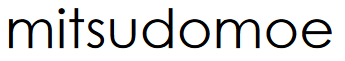
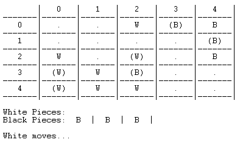
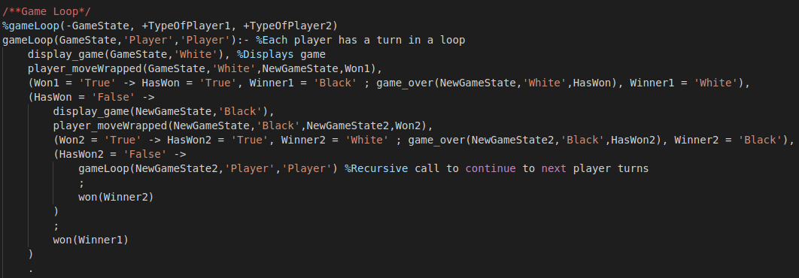

# PLOG2020

## Mitsudomoe Board game

### FEUP MIEIC PLOG 3rd year 2020/2021

__Class 2__
__Group Mitsudomoe_1__

##### Authors:

up201608657 Miguel Carreira Neves

up201806622 José Miguel Afonso Maçães

 
### Instalation and Execution

In order to play Mitusomoe you must:

- Run sicstus with command ```./sicstus```
- Consult game file using ```consult('pathto/mistudomoe.pl').```
- Enter command ```play.``` in SICStus

### Mitsudomoe
Mitsudomoe is a board game set in a **5x5 board**. Each player has **3 balls and 8 rings** to be placed on the board. Players take turns laying rings for their balls to move closer to their goal spaces. **The goal is to get all 3 of your balls to your goal spaces opposite your starting corner (your opponents starting spaces).**
The starting disposition consists of 3 balls placed on top of 3 rings in one corner of the board and the opponents 3 balls and rings placed in the same disposition in the opposite corner. Each player is left with 5 rings in hand to start the game.
A **turn** consist of performing 2 sequential steps:
**1) Ring Step:** Place a ring from your supply on the board or move one already played. You can move anywhere, including on top of other rings or stacks of rings, except on top of a ball.
**2) Ball Step:** Move a ball on the board. You can only move to a place with a ring of your color on top and to an adjacent space or you can vault your ball.

**Vault:** You can vault your ball in a straight line if every space between your ball and its destination has a ball on top (yours or opponents) and the destination space has a ring of your color on top. After you vault, every ball which you vaulted over that belonged to your opponent must be relocated to any space with your opponents color ring on top. **If you cannot relocate your opponents balls, you cannot perform the vault**.

If at any point you cannot do either step, you lose.

# Game Logic
## Internal Game Representation
### Board
The board is represented internally using a three-dimensional matrix (list of lists of stacks). The outer 5x5 matrix represents the spaces on the board, and a stack is used in each space to represent the stack of pieces on that space. Initially, every stack has an ```empty``` identifier, except for the starting spaces of each player, which have a stack of ball on top of ring on top of base. This also is on top of the ```empty``` identifier.
### Pieces
Rings and Balls are represented by atoms: ```whiteRing``` and ```blackRing``` are the atoms used to represent rings and ```whiteBall``` and ```blackBall``` are the atoms used to represent balls. There are also special atoms ```empty```, that represents an empty space and ```whiteBase``` and ```blackBase```, which represent each players home spaces.
### Pieces in Hand
Each players pieces in hand is represented by a list of ring atoms.
### Current Player
The current player is determined by a predicate gameLoop, that switches between players' turns.

```
%gameLoop(-GameState, +TypeOfPlayer1, +TypeOfPlayer2)
gameLoop(GameState,'Player','Player'):- %Each player has a turn in a loop
    display_game(GameState,'White'), %Displays game
    player_moveWrapped(GameState,'White',NewGameState,Won1),
    (Won1 = 'True' -> HasWon = 'True', Winner1 = 'Black' ; game_over(NewGameState,'White',HasWon), Winner1 = 'White'),
    (HasWon = 'False' ->  
        display_game(NewGameState,'Black'),
        player_moveWrapped(NewGameState,'Black',NewGameState2,Won2),
        (Won2 = 'True' -> HasWon2 = 'True', Winner2 = 'White' ; game_over(NewGameState2,'Black',HasWon2), Winner2 = 'Black'),
        (HasWon2 = 'False' ->
            gameLoop(NewGameState2,'Player','Player') %Recursive call to continue to next player turns
            ; 
            won(Winner2)
        )
        ;
        won(Winner1)
    ).
```

### Initial state
```
/**Initial Game State*/
%initial(-GameState) GameState->Tabuleiro,PecasDeCadaJogador
initial(
    [
        [ %Tabuleiro
            [[empty],[empty],[empty],[blackBall | [blackRing | [blackBase | [empty]]]],[blackBall | [blackRing | [blackBase | [empty]]]]],
            [[empty],[empty],[empty],[empty],[blackBall | [blackRing | [blackBase | [empty]]]]],
            [[empty],[empty],[empty],[empty],[empty]],
            [[whiteBall | [whiteRing | [whiteBase | [empty]]]],[empty],[empty],[empty],[empty]],
            [[whiteBall | [whiteRing | [whiteBase | [empty]]]],[whiteBall | [whiteRing | [whiteBase | [empty]]]],[empty],[empty],[empty]]
        ], 
        [ %PecasDeCadaJogador
            [whiteRing,whiteRing,whiteRing,whiteRing,whiteRing],%White
            [blackRing,blackRing,blackRing,blackRing,blackRing] %Black
        ]
    ]
).
```

### Intermediate state
```
intermediateMap(
    [
        [ %Tabuleiro
            [[empty],[empty],[whiteRing | [empty]],[blackBall | [blackRing | [blackBase | [empty]]]], [blackRing | [blackBase | [empty]]]],
            [[empty],[empty], [empty],[empty],[blackBall | [blackRing | [blackBase | [empty]]]]],
            [[whiteRing | [empty]],[empty],[whiteBall | [whiteRing | [empty]]],[empty],[blackRing | [empty]]],
            [[whiteBall | [whiteRing | [whiteBase | [empty]]]],[whiteRing | [empty]],[blackBall | [blackRing | [empty]]],[empty],[empty]],
            [[whiteBall | [whiteRing | [whiteBase | [empty]]]],[whiteRing | [whiteBase | [empty]]],[whiteRing | [empty]],[empty],[empty]]
        ], 
        [ %PecasDeCadaJogador
            [],%White
            [blackRing,blackRing,blackRing] %Black
        ]
    ]
).
```

### End state
```
endMap(
    [
        [ %Tabuleiro
            [[empty],[empty],[whiteBall | [whiteRing | [empty]]],[blackRing | [blackBase | [empty]]], [blackRing | [blackBase | [empty]]]],
            [[empty],[empty], [empty],[empty],[blackRing | [blackBase | [empty]]]],
            [[whiteRing | [empty]],[empty],[whiteBall | [whiteRing | [empty]]],[empty],[blackRing | [empty]]],
            [[blackBall | [blackRing | [whiteRing | [whiteBase | [empty]]]]],[whiteBall | [whiteRing | [empty]]],[blackRing | [empty]],[empty],[empty]],
            [[blackBall | [blackRing | [whiteBase | [empty]]]],[blackBall | [blackRing | [whiteBase | [empty]]]],[whiteRing | [empty]],[empty],[empty]]
        ], 
        [ %PecasDeCadaJogador
            [whiteRing, whiteRing],%White
            [] %Black
        ]
    ]
).
```

## Game Display
### Board
The board is displayed row by row, column by column, using ```display_game```. Only the pieces on top of the stack is displayed for each space. Letters (A-E) and numbers (1-5) are also displayed to aid references to spaces (Letter/Number coordinates).

```display_game``` uses the current game state to print out the board, using ```printMatrix``` and ```printStackRow```, the pieces still in each players hand, using ```printPiecesOnHand``` and the next player to play, using ```printWhoMoves```.
``` 
%display_game(+GameState,+Player) GameState->Tabuleiro,PecasDeCadaJogador Player->QuemJoga.ex:White

display_game(GameState,Player) :-
    getBoard(GameState,Board),
    nl,
    write('       |   0   |   1   |   2   |   3   |   4   |\n'), %Writes the column number for each column
    write('-------|-------|-------|-------|-------|-------|\n'),
    %TO DO display pieces available to player
    printMatrix(Board, 1),
    getPieces(GameState,Pieces),
    printPiecesOnHand(Pieces),
    printWhoMoves(Player).
 ```

### Pieces
Each space may have some simbols to represent what is on top of that space. An empty space is represented by ```' . '```, rings with the first letter of their colour (```' W '``` and ```' B '```), balls are similarly represented, but with parentheses around the letter (```'(W)'``` and ```'(B)'```). The home spaces of each player are represented by ```'WoW'``` (for white) and ```'BoB'``` (for black).
The pieces is hand are displayed using predicate printPiecesOnHand.
Current player is indicated on screen by the predicate printWhoMoves.

### Initial state


### Intermediate state


### End state


### Menu
A initial menu was created to let the user choose the game mode.


## Valid Moves List
To determine the valid moves list at any given time, it is necessary to know the current player and wether it is a ring move or a ball move. With that information, the board is scanned searching for pieces that can be moved, using the predicates isRingMoveStartValid and isBallMoveStartValid, which assess if at the starting position for a hypothetical move is a correct piece that should be moved, and scanned again searching for valid destinations using isRingMoveEndValid and isBallMoveEndValid, this last one assessing if the destination space of said move has a ring of the correct color, if the destionation position is adjacent to the starting position and, in case of a vault, if the opponent balls vaulted over can be relocated.

A move is represented by a list of the starting and ending coordinates and the piece to be moved, as so:
**[StartingColumn, StartingRow, DestinationColumn, DestinationRow, Piece]**
This information is displayed before a move is inserted by the player, so that they know what are the valid moves they can insert.

For example, a list of valid moves at a given time would be:


## Play Execution

Play flow is determined by the gameLoop predicate.



For each play, player_moveWrapped, a wrapper on player_move, is called. 
player_move calls valid_moves for the rings and prints those valid moves on the screen and then ringStep is called. ringStep will call both readRingMove, that reads the player move, coordinate by coordinate, returning a move, and handleRingMove, which will verify if the move is valid and then call move(+GameState,+Move,-NewGameState), which will return the new game state for after the move is played. After this, display_game will be called so the player can visually understand what they played.
This same process is repeated for the ball part of the move.

## End of Game
After every move, the predicate game_over is called, to check if the current game state corresponds to a winning one for the player that just played. This is done by calling areBallsOnOppositeBase, which will scan the opposing players home spaces to check if they are all being occupied by the players balls.

## Board Evaluation
After every move, the game state is evaluated in order to attribute a value to each player. 

## Computer Play

## Conclusion
This projects objective was to apply logic programming theory in Prolog in the form of a board game. 
The main difficulties encountered were about specific moves implementations, due to Prolog's recursive nature and backtracking, and also in the debugging process.
The main aspect that could be improved is 
To conclude, the project was developed with success, with the final result being a correctly implemented game, and it was very educational helping us learn more about logic programming.

## Documentation

- Slides
- [SWI](https://www.swi-prolog.org)